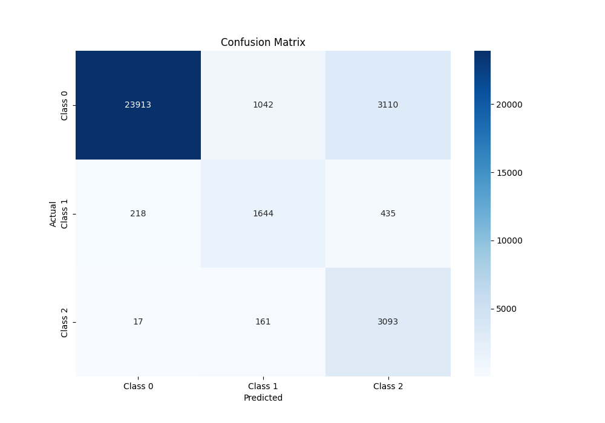

# Heartbeat Classification using CNN-LSTM based on AAMI Guidelines

## Project Overview

This project focuses on classifying heartbeats according to the AAMI guidelines using a CNN-LSTM model. The model utilizes a morphological vector and three additional features: the distance to the previous beat, the distance to the next beat, and the average distance of the last 10 beats. The preprocessing process includes segmentation, denoising, and normalization of ECG signals.

## Datasets

The following datasets were used for training and evaluation:

- **MIT-BIH Arrhythmia Database**: [PhysioNet MIT-BIH Arrhythmia Database](https://physionet.org/content/mitdb/1.0.0/)
- **St Petersburg INCART 12-lead Arrhythmia Database**: [PhysioNet St Petersburg INCART Database](https://physionet.org/content/incartdb/1.0.0/)
- **MIT-BIH Supraventricular Arrhythmia Database**: [PhysioNet MIT-BIH Supraventricular Arrhythmia Database](https://physionet.org/content/svdb/1.0.0/)

## Preprocessing Pipeline

The preprocessing of ECG signals includes the following steps:

1. **Segmentation**: Identification of heartbeats in the ECG signal.
2. **Denoising**: Noise removal from the signal using the Dual-Tree Complex Wavelet Transform (DTCWT) and baseline wander removal.
3. **Normalization**: Application of MinMax scaling to bring the signal values into a defined range.

### Denoising Details

- **DTCWT Denoising**: Removal of high-frequency noise components while preserving important morphological features of the signal.
- **Baseline Wander Removal**: Elimination of slow variations in the signal, such as those due to respiration, using median filters with window widths specific to P, QRS, and T waves.
- **Normalization**: Scaling the signal to a predetermined range to facilitate model training.

## Model Architecture

The adopted model is a hybrid combination of CNN and LSTM designed to leverage both temporal and spatial features of ECG signals:

- **Convolutional Layers**: Used to extract relevant spatial features from segments of the ECG signal.
- **LSTM Layer**: Processes morphological features to capture temporal dependencies between heartbeats.
- **Integration of RR Features**: The additional RR (Relative R-R intervals) features are concatenated with the LSTM output for further processing.
- **Fully Connected Layers**: Designed to classify heartbeats based on the extracted features.

## Project Structure

```
- checkpoints/
    - best_model.pth
- data/
    - raw_data/
    - processed_data/
        - ecg_training.csv
        - ecg_test.csv
- model/
    - model_handler.py
- dataset/
    - dataset_handler.py
- utils/
    - preprocessing_utils.py
    - denoising_utils.py
- run_preprocess.py
- train.py
- score.py
```

## Results

### Per-Class Accuracy
- **Class 0**: 35.38%
- **Class 1**: 74.89%
- **Class 2**: 58.78%
- **Class 3**: 92.66%

### Classification Report
| Class  | Precision | Recall | F1-Score | Support |
|--------|-----------|--------|----------|---------|
| Class 0| 0.01      | 0.35   | 0.02     | 65      |
| Class 1| 1.00      | 0.75   | 0.85     | 26731   |
| Class 2| 0.32      | 0.59   | 0.42     | 905     |
| Class 3| 0.46      | 0.93   | 0.62     | 3271    |

- **Test Loss**: 1.0136
- **Test Accuracy**: 76.22%



## Setup

To install the required dependencies for this project, use the `requirements.txt` file. Follow these steps:

1. **Create a virtual environment** (optional but recommended):
   ```bash
   python -m venv venv
   source venv/bin/activate  # On Windows use `venv\Scripts\activate`
1. **Install the dependencies:**:
   ```bash
   pip install -r requirements.txt

## Usage

1. **Preprocess the data**: Run `run_preprocess.py` to perform segmentation, denoising, and normalization of the raw data.
2. **Train the model**: Run `train.py` to train the model using the preprocessed data.
3. **Test the model**: Use `score.py` to evaluate the model on the test set.

## References

- MIT-BIH Arrhythmia Database: [PhysioNet MIT-BIH Arrhythmia Database](https://physionet.org/content/mitdb/1.0.0/)
- St Petersburg INCART Database: [PhysioNet St Petersburg INCART Database](https://physionet.org/content/incartdb/1.0.0/)
- MIT-BIH Supraventricular Arrhythmia Database: [PhysioNet MIT-BIH Supraventricular Arrhythmia Database](https://physionet.org/content/svdb/1.0.0/)
